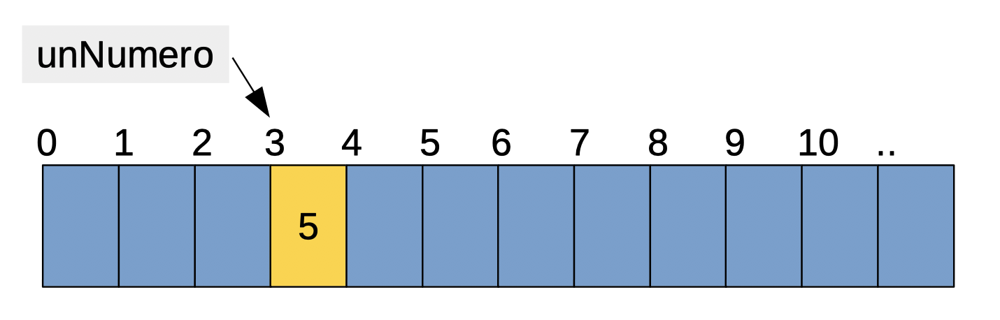
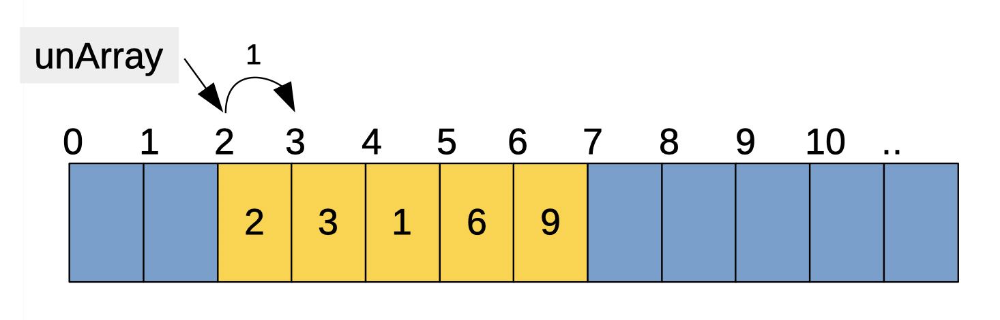
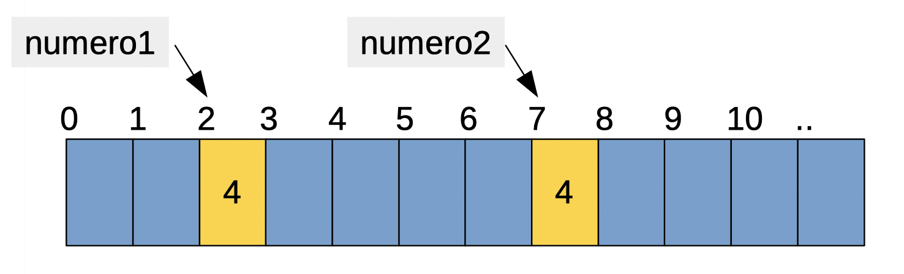

# How To's and What 's

- [Cómo luce la estructura base de un programa en GO?](#cómo-luce-la-estructura-base-de-un-programa-en-go)
- [Qué tipo de datos existen?](#qué-tipo-de-datos-existen)
- [Como declaro una variable?](#cómo-declaro-una-variable)
- [Cómo cambio el valor de una variable?](#cómo-cambio-el-valor-de-una-variable)
- [Cómo declaro una constante?](#cómo-declaro-una-constante)
- [Cómo cambio el valor de una constante?](#cómo-cambio-el-valor-de-una-constante)
- [Cómo escribo/imprimo a pantalla?](#cómo-escriboimprimo-a-pantalla)
- [Como leo del teclado?](#como-leo-del-teclado)
- [Qué operadores existen en GO?](#qué-operadores-existen-en-go)
- [Qué es un `if`?](#qué-es-un-if)
- [Cómo escribo un `if`?](#cómo-escribo-un-if)
- [Que es un `switch`?](#que-es-un-switch)
- [Cómo escribo un `switch`?](#cómo-escribo-un-switch)
- [Qué es un `for`?](#qué-es-un-for)
- [Cómo escribo un `for`?](#cómo-escribo-un-for)
- [Cómo escribo un `for`? (segunda parte)](#cómo-escribo-un-for-segunda-parte)
- [Cómo escribo un `for`? (tercera parte)](#cómo-escribo-un-for-tercera-parte)
- [Qué es un contador?](#qué-es-un-contador)
- [Qué es un acumulador?](#qué-es-un-acumulador)
- [Qué es un `array`?](#qué-es-un-array)
- [Cómo uso un `array`?](#cómo-uso-un-array)

## Cómo luce la estructura base de un programa en GO?
```go
package main

import "fmt"

func main() {
	fmt.Println("Hola Mundo!")
}
```

## Qué tipo de datos existen?
```go
bool

string

int  int8  int16  int32  int64
uint uint8 uint16 uint32 uint64 uintptr

byte // alias for uint8

rune // alias for int32
     // represents a Unicode code point

float32 float64

complex64 complex128
```

## Cómo declaro una variable?
```go
var number int = 1000
```

## Cómo cambio el valor de una variable?
```go
var number int = 1000
...
number = 2000
```

## Cómo declaro una constante?
```go
const number int = 1000
```

## Cómo cambio el valor de una constante?
Una constante no puede cambiar su valor a lo largo del programa, como el nombre lo indica es `constante`

## Cómo escribo/imprimo a pantalla?
Para imprimir a pantalla es necesario importar el paquete `"fmt"` y utilizar cualquiera de las funciones de impresión que define
```go
import "fmt"

func main() {
	...
	fmt.Print("Hola Mundo!")
	fmt.Println("Hola Mundo!")
	fmt.Printf("%s", "Hola Mundo!")
	...
}
```
De que va cada una?
```go
fmt.Print(valorAImprimir, otroValor, otro, etc..)
```
Imprime lo que se le pase por parámetro a la consola. Imprime todo tipo de dato y la cantidad que se quiera. Recibe de `1` a `n` parámetros.
```go
fmt.Println(valorAImprimir, otroValor, otro, etc..)
```
Funciona igual que `Print()` solo que agrega un salto de linea (`\n`) al final de la impresión
```go
fmt.Printf(formato, valorAImprimir, otroValor, otro, etc..)
```
Esta es la más compleja de todas pero a la vez la más maleable de todas. Espera como primer parámetro `string` que representará el formato de impresión y de ahí en adelante, los valores a imprimir. El `string` de formato puede ser simplemente una cadena de texto común y corriente o puede tener algunos caracteres especiales que serán reemplazados en el `string` final por los valores pasados posteriormente. Veamos un ejemplo:
Supongamos que queremos imprimir el siguiente texto
```
Mi nombre es Jose y tengo 20 años
```
y contamos con dos variables `nombre` y `anios` en nuestro programa. Si quisiéramos hacerlo con nuestra función `Print()` quedaría algo así
```go
fmt.Print("Mi nombre es ", nombre, " y tengo ", anios, " años")
```
Cómo verán no es difícil en si pero hay varias cosas de las que nos tenemos que hacer cargo y no olvidar como por ejemplo de los espacios entre el texto y las variables, de que los números se van a imprimir de una cierta forma y no podemos cambiar como lo hacen, etc..
Para tener un mayor control de la salida que queremos, podemos hacer uso de la función `Printf()`. Veamos como quedaría con esta función:
```go
fmt.Printf("Mi nombre es %s y tengo %d años", nombre, anios)
```
Si le prestaron atención habrán notado que aparecieron un `%s` y un `%d` en el `string` que le pasamos y que nuestras variables `nombre` y `anios` ahora las enviamos al final, es decir, le estamos pasando 3 parámetros, `formato`, `nombre` y `anios`. El concepto detrás de esto es:
- `%s` será reemplazado por el primer parámetro pasado que debe ser de tipo `string`
- `%d` será reemplazado por el segundo parámetro pasado que debe ser de tipo `int`

Esto nos permite tener mucho más control sobre la impresión final de salida pudiendo interpolar datos entre nuestro string sin tener que hacerlo a mano. Y no solo sirve para esto, también puede usarse para imprimir los datos con un formato específico. Por ejemplo si imprimiéramos un `float32` con `Print()` lo que veríamos sería esto
```go
var flotante float32 = 123.12356789
fmt.Print(flotante)
> "123.123566"
```
Y si lo hiciéramos con `Printf()` podríamos cambiar la cantidad de decimales con la que imprimirlo por ejemplo
```go
var flotante float32 = 123.12356789
fmt.Printf("%.2f", flotante)

> "123.12"
```
Así podemos ver que `Printf()` nos permite realizar impresiones más complejas con la dificultad extra de saber que formato usar. Los formatos más comunes son:
- `%s` Imprime un `string`
- `%d` Imprime un `int`
- `%f` Imprime un `float`
- `%t` Imprime un `bool`

Y sus variantes con tamaños mínimos de impresión (muy útil para hacer tablas)
- `%<width>s` Imprime un `string` con un mínimo de `width`
- `%<width>d` Imprime un `int` con un mínimo de `width`
- `%<width>.<precision>f` Imprime un `float` con un mínimo de `width` y con una precisión de `precision`
- `%<width>t` Imprime un `bool` con un mínimo de `width`

Y una yapa
- `%T` Imprime el tipo de dato

Algunos ejemplos
- Strings
```go
fmt.Printf("%s", "hola")

> "hola"
```
```go
fmt.Printf("%10s", "hola")

> "      hola" //largo 10 alineado a derecha
```
```go
fmt.Printf("%-10s", "hola")

> "hola      " //largo 10 alineado a izquierda
```
- Decimales
```go
fmt.Printf("%d", 1)

> "1"
```
```go
fmt.Printf("%5d", 1)

> "    1" //largo 5 alineado a derecha
```
```go
fmt.Printf("%-5d", 1)

> "1    " //largo 5 alineado a izquierda
```
- Flotantes
```go
fmt.Printf("%f", 1.232)

> "1.232"
```
```go
fmt.Printf("%11f", 1.232)

> "      1.232" //largo 11 alineado a derecha
```
```go
fmt.Printf("%.1f", 1.232)

> "1.2" // presicion 1 decimal
```
```go
fmt.Printf("%11.1f", 1.232)

> "        1.2" //largo 11 alineado a derecha con precision 1 decimal
```
```go
fmt.Printf("%-11.1f", 1.232)

> "1.2        " //largo 11 alineado a izquierda con precision 1 decimal
```
- Booleanos
```go
fmt.Printf("%t", true)

> "true"
```
```go
fmt.Printf("%10t", true)

> "      true" // largo 10 alineado a derecha
```
```go
fmt.Printf("%-10t", true)

> "true      " // largo 10 alineado a izquierda
```
- Mezclando lo que conocemos podemos lograr algo como esto:
```go
fmt.Printf("%-10s | %-10s | %8s | %4s \n", "Nombre", "Apellido", "DNI", "Edad")
fmt.Printf("%-10s | %-10s | %8s | %4d \n", "Jose", "Deniro", "24765394", 65)
fmt.Printf("%-10s | %-10s | %8s | %4d \n", "Mabel", "Stun", "29471323", 45)
fmt.Printf("%-10s | %-10s | %8s | %4d \n", "Federico", "Avalos", "30291423", 29)

> "Nombre     | Apellido   |      DNI | Edad"
> "Jose       | Deniro     | 24765394 |   65"
> "Mabel      | Stun       | 29471323 |   45"
> "Federico   | Avalos     | 30291423 |   29"
```

## Como leo del teclado?
Para leer de teclado es necesario importar el paquete `"fmt"` y utilizar cualquiera de las funciones de lectura que define
```go
import "fmt"

func main() {
	var unEntero int
	var unString string
	
	fmt.Scan(&unEntero)
	fmt.Scanln(&unString)
	fmt.Scanf("%d %s", &unEntero, &unString)
	...
}
```
La forma de leer del teclado (o sea de standard input o entrada estándar) es mediante nuestro querido amigo, el paquete `"fmt"`. `"fmt"` nos provee funciones para leer de teclado análogas a las funciones para imprimir:
```go
fmt.Scan(&valorALeer, &otroValor, &otro, etc...)
fmt.Scanln(&valorALeer, &otroValor, &otro, etc...)
fmt.Scanf(formato, &valorALeer, &otroValor, &otro, etc...)
```
De que va cada una?
```go
fmt.Scan(&valorALeer, &otroValor, &otro, etc...)
```
Esta función sencillamente lee de teclado tantos valores como variables se le hayan pasado. El tipo de dato leído tiene que coincidir con el tipo de dato de la variable. Los datos ingresados pueden estar separados tanto por espacios como por enters (nueva linea o `\n`).

```go
fmt.Scanln(&valorALeer, &otroValor, &otro, etc...)
```
Esta funciona igual que la anterior salvo que un enter (nueva linea o `\n`) es reconocido como final de entrada. Es decir, si usamos este tipo de lectura para leer 5 números, los 5 números tendrán que ser ingresados en una sola linea separadas por espacios.

```go
fmt.Scanf(formato, &valorALeer, &otroValor, &otro, etc...)
```
Funciona igual que las anteriores solo que los tipos de datos leído y el formato son especificados en el `string` de formato (ver Cómo escribo/imprimo a pantalla? para más detalle en el manejo del formato). En otras palabras, podemos crear nuestro propio formato de entrada separado por espacios, comas, guiones, etc.. lo que necesitemos.

Ahora hay varias cosas que pasamos por alto. Por lo menos tres:
1. Qué es ese `&` (andpersand) que va delante del nombre de las variables?
2. Qué pasa si el usuario ingresa mal un valor?
3. Siempre tengo que declarar una variable para poder leer un valor?

Vamos a responder de a una. La primera:
1. Qué es ese `&` (andpersand) que va delante del nombre de las variables?

Ese `&` es un operador unario (es decir, que solo necesita de un operando) que aplicado a un nombre de variable, nos devuelve la dirección en memoria de dicha variable. Suena a chino básico? no hay problema, la idea que subyace en esto es darle la capacidad a `Scanf()` de poder modificar nuestra variable. Por el momento lo vamos a dejar acá y más adelante lo veremos en detalle. Basta con saber que a `Scanf()` hay que pasarle nuestras variables con el `&` delante, es decir, hay que pasarle la dirección de nuestras variables.

2. Qué pasa si el usuario ingresa mal un valor?

Bueno, esto es un problema recurrente en cualquier programa que hagamos. El usuario siempre intentará jugar con él y probar cosas raras, por ejemplo, ingresar una letra cuando le pedimos que ingrese un numero. Ahora, cómo validamos la integridad de lo que nos ingresó en nuestro sistema? La respuesta es: **por el momento no vamos a hacerlo**. Hacerlo supone hablar y explayarse más en lo que se conoce como el manejo de errores en una aplicación o programa y todavía no es el momento. Lo que sí vamos a hacer es asumir que el usuario siempre nos ingresará el tipo de dato pedido aunque tal vez no sea correcto. Ejemplo: Pedimos que ingrese su edad, para eso leemos un entero del teclado. El usuario ingresa el número y nosotros solo validaremos que ese número sea válido, osea, que sea positivo y no mayor a 150 (por dar un ejemplo). O si le pidiéramos al usuario ingresar una respuesta de `si` o `no`, asumiremos que el usuario nos ingresa un `string` pero validaremos que el `string` es un `si` o un `no`.

3. Siempre tengo que declarar una variable para poder leer un valor del teclado?

La respuesta es sí. Necesitamos poder almacenar el valor leído en alguna variable por lo que es necesario previamente declarar una.

Veamos algunos ejemplos:
```go
var numero int
fmt.Print("Ingrese un número: ")
fmt.Scan(&numero)

fmt.Println("El número ingresado fue ", numero)

> "Ingrese un número: " 3 //numero ingresado por el usuario
> "El número ingresado fue 3"
```
```go
var numero1 int
var numero2 int
fmt.Print("Ingrese dos números: ")
fmt.Scan(&numero1, &numero2)

fmt.Println("La suma es ", numero1 + numero2)

> "Ingrese dos números: " 3 65 //Numeros separados por espacios ingresados por el usuario
> "La suma es 68"
```
```go
var numero1 int
var numero2 int
fmt.Print("Ingrese dos números: ")
fmt.Scan(&numero1, &numero2)

fmt.Println("La suma es ", numero1 + numero2)

> "Ingrese dos números: " 3 
> 65 // numeros separados por enters ingresados por el usuario
> "La suma es 68"
```
```go
var numero1 int
var numero2 int
fmt.Print("Ingrese dos números: ")
fmt.Scanln(&numero1, &numero2)

fmt.Println("La resta es ", numero1 - numero2)

> "Ingrese dos números: " 23 4 // numeros separados por espacios ingresados por el usuario
> "La resta es 19"
```
```go
var numero1 int
var numero2 int
fmt.Print("Ingrese dos números: ")
fmt.Scanln(&numero1, &numero2)

fmt.Println("La resta es ", numero1 - numero2)

> "Ingrese dos números: " 23 
> 4 // ERROR: numeros separados por enters ingresados por el usuario 
> "La resta es 19"
```

```go
var numero1 int
var numero2 int
fmt.Print("Ingrese dos números separados por un guión: ")
fmt.Scanf("%d-%d", &numero1, &numero2)

fmt.Println("La multiplicación es ", numero1 * numero2)

> "Ingrese dos números separados por un guión: " 20-3 // numeros separados por guión ingresados por el usuario
> "La multiplicación es 60"
```
```go
var unString string
fmt.Print("Ingrese su nombre: ")
fmt.Scanf("%s", &unString)

fmt.Printf("Hola ", unString, ", que gusto verte!")

> "Ingrese su nombre: " Leandro
> "Hola Leandro, que gusto verte"
```
Una última aclaración, notar como siempre antes de un `Scan()`, `Scanln()`, `Scanf()` hay un `Print()`, `Println()`, `Printf()`. Esto se debe a que es necesario indicarle al usuario qué es lo que queremos que haga. Si no pusiéramos esos prints, el usuario no sabría qué hacer, simplemente la pantalla se quedaría en negro y esperando el ingreso de datos que nunca van a ocurrir u ocurrirán por accidente.

## Qué operadores existen en GO?
Existen varios tipos de operadores en GO:

 1. Aritméticos
 2. De Comparación
 3. Lógicos

Veamos
1. Aritméticos
El valor que devuelven estos operadores depende de los operandos. Si se usa el operador con dos enteros, devolverá un entero, dos decimales devolverá un decimal

| Operador | Nombre | Aplica a | Explicación | Tipo
|--|--|--|--|--|
| + | suma | `int` `float` `string` | Suma dos elementos | Binario
| - | resta | `int` `float` | Resta dos números | Binario
| * | multiplicación | `int` `float` | Multiplica dos números | Binario
| / | división | `int` `float` | Divide dos números | Binario
| % | resto de la división | `int` | Divide dos números enteros y devuelve el resto | Binario
| ++ | incremento | `int` `float` | Es un equivalente a `x = x + 1` | Unario
| -- | decremento | `int` `float` | Es un equivalente a `x = x - 1` | Unario

2. De Comparación
El valor que devuelven estos operadores es siempre un `bool` independientemente del tipo de los operandos

| Operador | Nombre | Aplica a | Explicación | Tipo |
|--|--|--|--|--|
| == | igualdad | Todos | Devuelve si dos elementos son iguales | Binario
| != | desigualdad | Todos | Devuelve si dos elementos no son iguales | Binario
| < | menor | `int` `float` `string` | Devuelve si un elemento es menor que otro | Binario
| <= | menor o igual | `int` `float` `string` | Devuelve si un elemento es menor o igual que otro | Binario
| > | mayor | `int` `float` `string` | Devuelve si un elemento es mayor que otro | Binario
| >= | mayor o igual | `int` `float` `string` | Devuelve si un elemento es mayor o igual que otro | Binario

3. Lógicos
El valor que devuelven estos operadores son siempre `bool` y se aplican siempre a expresiones `bool`

| Operador | Nombre | Aplica a | Explicación | Tipo |
|--|--|--|--|--|
| && | y (and) | `bool` | Devuelve `true` si los dos operandos son `true` | Binario |
| \|\| | o (or) | `bool` | Devuelve `true` si al menos uno de los dos operandos es `true` | Binario |
| ! | no (not) | `bool` | Niega el valor de verdad del operando | Unario|

## Qué es un `if`?
Un `if` es una estructura de control propio de los lenguajes procedurales o imperativos. Es una estructura que permite bifurcar el flujo de un programa en dos dependiendo de cierta condición. Con un `if` uno puede agregar comportamiento variable a un programa si cierta condición se cumple, si no se cumple, o ambas. Los `if`s se pueden anidar la cantidad de veces que necesitemos lo que quiere decir que podemos complejizar la lógica de nuestro programa tanto como queramos.

## Cómo escribo un `if`?
La sintaxis más sencilla para escribir un `if` es la siguiente:
```go
if <expresion> {
	<codigo>
}
```
Donde:
- `<expresion>` es cualquier expresión válida que devuelva un `bool`. Puede ser tan sencilla como simplemente una variables `booleana` o tan compleja como una serie de `&&` y `||` con llamados a funciones o lo que fuere.
- `<codigo>` es cualquier bloque de código valido para GO que será ejecutado si y solo si la `<expresion>` es `true`

Ej: 
```go
var numero int
fmt.Print("Ingrese un numero: ")
fmt.Scan(&numero)

if numero > 45 {
	// Este bloque de codigo será ejecutado solo si numero es mayor a 45
	fmt.Print("El numero ingresado es mayor a 45")
}
```

Existe una variante más completa que permite ejecutar diferente código dependiendo si la expresión fue `true` o `false`
```go
if <expresion> {
	<codigoSiVerdadero>
} else {
	<codigoSiFalso>
}
```
Donde:
- `<expresion>` es cualquier expresión válida que devuelva un `bool`.
- `<codigoSiVerdadero>` es cualquier bloque de código valido para GO que será ejecutado si y solo si la `<expresion>` es `true`
- `<codigoSiFalso>` es cualquier bloque de código valido para GO que será ejecutado si y solo si la `<expresion>` es `false`

Ej:
```go
var edad int
fmt.Print("Ingrese su edad: ")
fmt.Scan(&edad)

if edad < 0 || edad > 150 {
	// Este bloque de código solo será ejecutado si la edad ingresada es menor a 0 o mayor a 150
	fmt.Print("La edad ingresada no parece ser muy confiable")
} else {
	// Y este bloque de código será ejecutado solo si edad está entre 0 y 150
	fmt.Printf("Me alegra saber que tienes %d años", edad)
}
```

Por último existe una forma de reflejar el caso de no solo 2 condiciones, sino más, tantas como se quieran. La idea detrás de esto es sencillamente proveer una forma elegante de escribir varios ifs anidados. Pensemos en el siguiente ejemplo. Quiero pedirle al usuario su edad y poder decirle en que etapa de su vida está. Si es un niño, un adolescente, un joven, un adulto o un anciano. Para eso pensemos como sería con lo que sabemos:
```go
var edad int
fmt.Print("Ingrese su edad: ")
fmt.Scan(&edad)

if edad < 15 {
	fmt.Print("niño")
} else {
	if edad < 25 {
		fmt.Print("adolescente")
	} else {
		if edad < 37 {
			fmt.Print("joven")
		} else {
			if edad < 65 {
				fmt.Print("adulto")
			} else {
				fmt.Print("anciano")
			}
		}
	}
}
```
El programa anterior funciona y no hay ningún inconveniente con él. Salvo, salvo, salvo que se nos complica un poco la lectura. La lógica detrás de el es correcta:
- `[-inf, 15)` -> es un niño
- `[15, 25)` -> es un adolescente
- `[25, 37)` -> es un joven
- `[37, 65)` -> es un adulto
- `[65, +inf)` -> es un anciano

Pero la forma de escribirlo es un poco confuso 
```go
if edad < 15 {
	// si edad < 15
} else {
	// sino, si edad >= 15
	if edad < 25 {
		// si edad < 25
	} else {
		// sino, si edad >= 25
		if edad < 37 {
			// si edad < 37
		} else {
			// sino, si edad >= 37
			...
		}
	}
}
```

En GO existe una forma mas concisa de escribir esta lógica y es la siguiente:
```go
if edad < 15 {
} else if edad < 25 {
} else if edad < 37 {
} ...
```
La estructura se llama `else if`. Si rehacemos el ejercicio utilizando esta nueva forma veremos que queda mucho mas claro y ordenado:
```go
var edad int
fmt.Print("Ingrese su edad: ")
fmt.Scan(&edad)

if edad < 15 {
	fmt.Print("niño")
} else if edad < 25 {
	fmt.Print("adolescente")
} else if edad < 37 {
	fmt.Print("joven")
} else if edad < 65 {
	fmt.Print("adulto")
} else {
	fmt.Print("anciano")
}
```
Se ve a simple vista la comodidad de uno con respecto al otro. De todas formas, queda a gusto del quién lee el usar una forma u otra.

## Que es un `switch`?
Un `switch` es una estructura de control que viene a mejorar la forma en que representamos múltiples caminos (no solo 2) dependiendo de una condición o valor dado. Es como un `if` pero en lugar de solo bifurcar, puede evaluar una expresión _x_ y ejecutar código dependiendo del valor de esa expresión. (Realmente un como un `else if` más legible)

## Cómo escribo un `switch`?
El `switch` se escribe de la siguiente forma:
```go
switch <expresion> {
case <expresion>:
	<codeIfExpresionMatchs>
case <expresion>:
	<codeIfExpresionMatchs>
case <expresion>:
	<codeIfExpresionMatchs>
default:
	<codeIfExpresionDontMatch>
}
```
Donde:
- `<expresion>` es cualquier expresión que devuelva un valor. Puede ser de cualquier tipo. Dicho valor será comparado luego (uno por uno) con todas las `<expresion>` en los case y la que matchee, será la que ejecute el código.
- `<codeIfExpresionMatchs>` es cualquier bloque de código válido para GO que será ejecutado si la expresión del case que la contiene matchea.
- `<codeIfExpresionDontMatch>` es cualquier bloque de código válido para GO que será ejecutado si la expresión de ningún case matcheó.

Ejemplo: Queremos saber dado un `string`, en que día de la semana me encuentro sabiendo que el día 1 es domingo.
```go
var diaDeLaSemana string = "martes"

switch diaDeLaSemana {
case "domingo":
	fmt.Print(1)
case "lunes":
	fmt.Print(2)
case "martes":
	fmt.Print(3)
case "miercoles":
	fmt.Print(4)
case "jueves":
	fmt.Print(5)
case "viernes":
	fmt.Print(6)
case "sabado":
	fmt.Print(7)
default:
	panic("Error!")
}
```
## Qué es un `for`?
El `for` es una estructura de repetición usada para ejecutar un mismo código una cierta cantidad de veces o hasta que se cumpla determinada condición. Es una estructura que nos permite manejar mucha cantidad de datos sin tener que saber cuántos al momento de compilación. Piensen en el caso de encontrar un máximo entre 2 valores dados, es sencillo, verdad? qué pasaría si fueran 3? y si fueran 5? y si no supiéramos cuántos datos son? Uno no puede escribir `if`s indefinidamente. Los `if`s que no estén al momento de compilación no podrán ser agregados posteriormente por lo que necesitamos de una estructura que nos permita manejar esta complejidad. Para ello aparece el `for`. Si tuviéramos que encontrar el máximo entre _n_ números nos bastaría con ir comparando números de a pares, compararlos y quedarnos con el mayor y usarlo en la próxima comparación. Al final el valor que nos quede será el mayor. Este tipo de lógica es la que nos permite agregar el `for`

## Cómo escribo un `for`?
El `for` más habitual se escribe de la siguiente forma:
```go
for <preEjecucion>; <condicion>; <posEjecucion> {
	<codigo>
}
```
Donde:
- `<preEjecucion>` es una expresión (normalmente una asignación) que es ejecutada **una única vez**  antes de entrar a ejecutar el primer ciclo del `for`.
- `<condicion>` es una expresión booleana (es decir, que devuelve un `bool`) que será evaluada antes de comenzar **cada**  iteración del `for`.
- `<posEjecucion>` es una expresión (normalmente un incremento de  variables) que será ejecutada al final de **cada** iteración del `for`.
- `<codigo>` es cualquier bloque valido para GO que será ejecutado si y solo si `<condicion>` es `true`. 

Entonces pasemos en limpio un poco como es el flujo que hará la estructura de repetición `for`:
1. Ejecutará `<preEjecucion>` por única vez
2. Evaluará la expresión `<condicion>`
3.  Si `<condicion>` es `true`
	- Ejecutará el `<codigo>` dentro del ciclo
	- Ejecutará la `<posEjecucion>`
	- Vuelve al paso 2
4. Si `<condicion>` es `false`
	- Sale del ciclo y continúa la ejecución en la primera instrucción que siga luego de la llave de fin del ciclo `for`

Habiendo analizado un poco el funcionamiento abstracto, pongamos un ejemplo para bajarlo más a tierra.
Imaginemos que queremos simplemente hacer un programa que cuente del 1 al 100. Primero veamos como sería el programa sin la estructura `for`
```go
fmt.Println(1)
fmt.Println(2)
fmt.Println(3)
fmt.Println(4)
fmt.Println(5)
fmt.Println(6)
fmt.Println(7)
... // Cortamos el programa por un tema de espacio
... // Pero se sobreentiende que la forma de hacerlo es por fuerza bruta con 100 lineas de fmt.Println(...)
fmt.Println(97)
fmt.Println(98)
fmt.Println(99)
fmt.Println(100)
```

Ahora veamos de que forma podemos lograrlo usando nuestra estructura `for`

```go
var i int

for i = 1; i <= 100; i++ {
	fmt.Println(i)
}
```

Bastante más conciso, no? Repasemos como fue el flujo del programa:
- Declaramos la variable `i` de tipo entero
- Asignamos 1 a `i` por única vez
- Preguntamos si `i <= 100` (osea si `1 <= 100`)
- Como es cierto ejecutamos `fmt.Println(i)` (osea `fmt.Println(1)`)
- Como no hay mas instrucciones dentro del bloque, ejecutamos `i++` (osea, incrementamos en 1 el valor de `i` quedando en 2)
- Preguntamos si `i <= 100` (osea si `2 <= 100`)
- Como es cierto ejecutamos `fmt.Println(i)` (osea `fmt.Println(2)`)
- Como no hay mas instrucciones dentro del bloque, ejecutamos `i++` (osea, incrementamos en 1 el valor de `i` quedando en 3)
- Preguntamos si `i <= 100` (osea si `3 <= 100`)
- Como es cierto ejecutamos `fmt.Println(i)` (osea `fmt.Println(3)`)
- ..... Y asi podríamos seguir muchas veces más. Para ahorrar espacio, seguiremos con la misma idea pero suponiendo que `i` ya llego al valor de 99
- Preguntamos si `i <= 100` (osea si `99 <= 100`)
- Como es cierto ejecutamos `fmt.Println(i)` (osea `fmt.Println(99)`)
- Como no hay mas instrucciones dentro del bloque, ejecutamos `i++` (osea, incrementamos en 1 el valor de `i` quedando en 100)
- Preguntamos si `i <= 100` (osea si `100 <= 100`)
- Como es cierto ejecutamos `fmt.Println(i)` (osea `fmt.Println(100)`)
- Como no hay mas instrucciones dentro del bloque, ejecutamos `i++` (osea, incrementamos en 1 el valor de `i` quedando en 101)
- Preguntamos si `i <= 100` (osea si `101 <= 100`)
- Y por fin llegamos a que la condición no es cierta ya que `101 > 100` por lo que nuestro programa sale del ciclo `for`
- Y termina exitosamente

Observaciones:
- Dentro del ciclo `for`  podemos modificar cualquier variable declarada fuera del ciclo incluida la variable `i`. Es una variable más por lo que podríamos modificarla a gusto y provocar que el ciclo termine antes o incluso nunca termine (Si tiene curiosidad, puede intentarlo)
- La variable `i` que utilizamos en los ejemplos bien podrían llamarse `juanito`, `valor`, `nombre`, etc. Se usa el nombre `i` por convención (normalmente se refieren a índices (index)). Si bien se puede cambiar y usar la que se quiera, no se recomienda hacerlo salvo que sea un tema de legibilidad o esté justificado. 
- Se pueden anidar ciclos `for` tantos como quieran. Es decir, dentro de un ciclo `for` puede haber otro ciclo `for` y otro y otro (todos los que se quieran). Normalmente a las variables de los diferentes niveles de anidamiento, se les suele ir nombrando como `i`, `j`, `k`, `l` (rara vez se llega tan adentro)
- Si bien la estructura del `for` que se presentó es la más completa, bien puede obviarse la `<preEjecucion>`, `<posEjecucion>` e incluso la `<condicion>` (Notar que si no se escribe una `<condicion>` el ciclo seguirá por siempre a menos que sea interrumpido)

## Cómo escribo un `for`? (segunda parte)
Ya vimos la forma más habitual de escribir un ciclo `for`. La misma proponía dividir la estructura en 3 partes, una `<preEjecucion>`, `<condicion>` y `<porEjecucion>`. Dicha división está pensada para cuando uno conoce la cantidad de datos existentes y quiere iterarlos a todos. El problema (o el inconveniente) de esta forma es, que pasa si no conozco la cantidad de datos que voy a iterar? La forma de leer el `for` con dicha estructura sugiere que mi `<preEjecucion>`, `<condicion>` y `<porEjecucion>` comparten una variable en común y que van a estar relacionados de alguna manera. Por ejemplo, vimos como imprimir los números del 1 al 100 usando una variable `i` que usada en las tres secciones y su vinculación era directa: Iniciamos el contador el 1, por cada ejecución aumentamos 1 al contados y lo hacemos hasta que el contador supere el valor de 100. 
Qué pasaría ahora si queremos repetir una porción de código indefinidamente hasta que cierta condición se satisfaga. Por ejemplo: Pensemoario una respuesta de `"si"` ara realizar algo. 
- Si la respuesta es `"si"` -> realizamos la acción
- Si la respuesta es `"no"` -> no realizamos la acción
- Si la respuesta no es ni `"si"` ni `"no"` -> volvemos a preguntar

Veamos como podemos escribir este `for:`:
```go
var respuesta string
for respuesta != "si" && respuesta != "no" {
	fmt.Print("Esta seguro que desea borrar todo (si/no)? ")
	fmt.Scan(&respuesta)
}
if respuesta == "si" {
	fmt.Println("Borrando todo!")
} else {
	fmt.Println("No se ha realizado ninguna accion")
}
```
Notar tres cosas:
1. No hay una `<preEjecucion>`
2. No hay una `<posEjecucion>`
3. No están los `;` separadores

El lenguaje nos deja (si es que no están presentes ambos), escribir un `for` con solo una `<condicion>` que será evaluada antes de cada iteración igual que pasaba con el `for` completo. La diferencia principal es que no hay una `<preEjecucion>` ni `<posEjecucion>`. La condición de corte depende de un valor que debería cambiar en el cuerpo del `for` y el cambio no tiene por qué obedecer un patrón (si obedeciera un patrón, usaríamos un for completo). Este tipo de estructura si bien es un `for` en otros lenguajes se conoce como un `while`. En Go no vamos a encontrar un `while` y la justificación que tienen es que sencillamente no son dos loops diferentes, sol lo mismo y por lo tanto deberían nombrarse igual. (Todo lo que se hace con un `while` puede hacerse con un `for` y todo lo que se hace con un `for` puede hacerse con un `while`)

Veamos ahora como reescribiríamos el algoritmo de impresión de los primeros 100 números con nuestro nuevo `for` y veamos a que conclusión llegamos:
```go
var i int

i = 1
for i <= 100 {
	fmt.Println(i)
	i++
}
```
Sigue siendo mucho más sencillo que nuestra versión a fuerza bruta (utilizando cien `fmt.Println(..)`) pero hay algo que se siente raro o debería llamar la atención y es que tenemos una inicialización **única** antes de empezar el ciclo `for`, y tenemos cambios que obedecen a un patrón sobre la variable que incide en la condición que ocurre al final de **todas** las ejecuciones del ciclo... Esto sugiere que la primera estructura `for` completa que vimos se amolda mucho mejor a lo que queremos representar que nuestra nueva forma más corta. Una vez más se recuerda que todo lo que hagamos con un `while` (nuestro `for` simple) se puede hacer con un `for` (nuestro `for` completo) ergo, nuestra elección no va a determinar el funcionamiento o no del programa (solo se pretende abrir la discusión y que puedan sacar sus conclusiones de un debate que tiene más años que la humedad).
Entonces, cuándo elegir uno y cuándo elegir otro? Bueno la respuesta no está tallada en piedra pero si se puede esbozar una especie de regla:
- Si se precisa una inicialización que ocurra una única vez, una actualización conforme a un patrón en cada iteración y la cantidad de iteraciones es conocida -> debería utilizarse el `for` completo
- Si por el contrario la cantidad de iteraciones no es conocida y no se debería actualizar nuestra variable de corte conforme a un patrón conocido -> debería utilizarse el `for` simple
- Para cualquier híbrido entre medio, se apela al buen juicio y legibilidad de lo que se está haciendo

## Cómo escribo un `for`? (tercera parte)
Ya vimos el `for` completo (con sus 3 partes `<preEjecucion>`,  `<condicion>`, `<posEjecucion>` ), el `for` simple (con su única parte `<condicion>`) y ahora nos toca ver el `for` infinito. Si infinito! 
Veamos primero como se ve antes de explicar su uso:
```go
for {
	fmt.Println("Esto se repitará indefinidamente")
}
```
Era de esperarse, no? Nuestro `for` infinito no tiene ninguna de las tres partes preexistentes. Nuestro `for` infinito se ejecutará indefinidamente. Al no tener condición de corte, no evaluará jamás ninguna expresión booleana y jamás cortará.
Es posible que surjan por lo menos dos preguntas al respecto:
1. Para que lo quiero, en que contexto necesitaría ejecutar algo para siempre (cuál es su función)
2. Existe alguna forma de cortar la ejecución o realmente es infinito?

Bueno, vamos por partes. Respondamos primero la primer pregunta:
1. Para que lo quiero, en que contexto necesitaría ejecutar algo para siempre (cuál es su función)

Piensen en un juego. Un juego (por más que jamás lo hayamos pensado) no deja de ser un programa que maneja todas las estructuras que estamos aprendiendo nosotros. Y por lo tanto estamos a solo unos pasos de poder hacer cosas así (o por lo menos de entender que está pasando por detrás..). 
Un juego, para dar la sensación de realidad, tiene que simular que el tiempo pasa y que las cosas se mueven, colisionan, caen, vuelan, etc.. Pueden pensar un juego como una serie de imágenes que van apareciendo una tras otra. A la medida de la cantidad de imágenes que se ven por segundo se la conoce como FPS (Frames Per Second) o imágenes por segundo. Dichas imágenes que se muestran una tras otra de forma permanente da la sensación de continuidad que sentimos cuando los jugamos. Esto no difiere mucho de una película. Ambos deben mostrar una sucesión de imágenes a gran velocidad para dar esa sensación de estar "vivo". 
La GRAN diferencia que tienen ambas modalidades es que uno conoce todas las imágenes que va a mostrar y en qué momento mostrarlas de antemano (una película) y el otro no conoce ni las imágenes ni el tiempo (un juego), las tiene que "calcular". Una película siempre va a ser igual, uno no puede hacer que el personaje principal en lugar de hablar con la chica, se tome un helado. En cambio, en un juego, uno toma esas decisiones todo el tiempo. Cada frame, es calculado en base al input del usuario (a lo que el usuario ingresó), a la velocidad de los objetos que están en la escena, a las fuerzas que hayan actuado, a el daño que puede haber recibido, a la gravedad, etc. Todo eso se calcula cada frame. 
Imaginen que si hubiera un `if` por cada frame y cada caso de frame, el programa tendería a ser infinito. Deberíamos tener una función que dado el estado actual de todo el juego, nos devuelva el nuevo pasado x tiempo y ejecutar esta actualización **indefinidamente**.
Ahí llegamos. **Indefinidamente**. Indefinidamente quiere decir infinitamente hasta que algo pase. Y que es eso que pasa? Bueno en un juego, puede ser el usuario poniendo `pause`, mostrando una presentación o apretando `Alt+F4`. 
Cuando uno habla de una ejecución indefinida está hablando de nuestro `for` infinito. Este es un caso más que conocido de ciclos infinitos. Es tan conocido que hasta tiene su propio nombre, lo llaman `game loop`. Y es un perfecto uso para nuestro `for` infinito.

Otro tipo de aplicaciones de ciclos infinitos pueden ser programas ejecutados en micro controladores por ejemplo, un holter. Un holter es un aparato que desde que es prendido, toma la presión de quien lo tiene puesto cada `x` tiempo. Si uno no lo apaga, el holter seguirá censando indefinidamente.

Pero una vez más llegamos a que indefinidamente no es para siempre. Hay excepciones. Como manejamos esas excepciones? Como cortamos el flujo infinito? Para eso vamos a la segunda pregunta

2. Existe alguna forma de cortar la ejecución o realmente es infinito?

Como uno puede ir suponiendo, los ciclos pueden cortarse prematuramente. Todos los ciclos. Y en particular, en los infinitos, es bastante útil.
Veamos cómo se haría con un ejemplo. Veamos una simplificación de un `game loop`:
```go
for {
	input = readInput() // lee lo que el usuario haya ingresado (arriba, abajo, barra espaciadora, escape, etc)
	updateCharacter(input) // actualiza la posicion del personaje
	updatePhysics() // actualiza las posiciones de todos los objetos del juego
	updateFrame() // en base a todos los objetos en el juego, crea la nueva imagen y la muestra
	
	if (input == EXIT_GAME) {
		break // si el input es EXIT_GAME, rompe el ciclo infinito
		fmt.Println("Adios")
	}
}
fmt.Println("Algo pasó que saliste del loop")
```
En el algoritmo podemos ver que se va a ejecutar dicha secuencia de sucesos indefinidamente hasta que `input` sea igual a `EXIT_GAME`. Cuando esa condición se da, se ejecuta un `break`. Y ese `break` es lo que estábamos buscando. 
El `break` rompe la ejecución del ciclo que la contiene al momento. Notar que ese `fmt.Println("Adios")` que sigue al `break` nunca será ejecutado. Cuando se rompa la ejecución, el programa seguirá con la próxima instrucción que le siga al `for`, en este caso se ejecutará el `fmt.Println("Algo pasó que saliste del loop")` y continuará normalmente el programa.

El lector avispado podrá notar que se puede hacer lo mismo con el `for` simple en donde la condición sea `input != EXIT_GAME`.
```go
for input != EXIT_GAME {
	input = readInput() // lee lo que el usuario haya ingresado (arriba, abajo, barra espaciadora, escape, etc)
	...
}
fmt.Println("Algo pasó que saliste del loop")
```
Es correcto para este ejemplo trivial. El problema real es que ese `break` podría estar (y normalmente lo hace) muchos ifs anidados para adentro con condiciones especiales en las que el `for` simple queda chico. igualmente siempre que se note que con un `for` simple o completo se puede realizar lo mismo, hacerlo con dichas estructuras. El `for` infinito es para casos muy especiales.

Por último existe otra palabra reservada con significado especial dentro de los ciclos y esa es `continue`. `continue` lleva el flujo del programa al final del bloque del `for` y ejecuta la `<posEjecucion>` y `<condicion>` normalmente. Sirve normalmente para optimizar algoritmos y reducir el tiempo de cada ciclo.
Por ejemplo, siguiendo con el ejemplo del `game loop` si se sabe que cuando el usuario no interactúa con el juego, la imagen no cambia nada (por ejemplo, el solitario de windows), se podría optimizar nuestro juego de la siguiente forma:
```go
for {
	input = readInput() // lee lo que el usuario haya ingresado (arriba, abajo, barra espaciadora, escape, etc)
	if (input == nil) {
		continue // si el usuario no interactúa, evitamos la actualizacion de todo el juego ya que seguiría igual
	}
	updateCharacter(input) // actualiza la posicion del personaje
	updatePhysics() // actualiza las posiciones de todos los objetos del juego
	updateFrame() // en base a todos los objetos en el juego, crea la nueva imagen y la muestra
	
	if (input == EXIT_GAME) {
		break // si el input es EXIT_GAME, rompe el ciclo infinito
		fmt.Println("Adios")
	}
}
fmt.Println("Algo pasó que saliste del loop")
```
En este caso, si el usuario no interactúa con el sistema, el flujo del programa seguirá en la primera linea del `for` de igual forma que lo hubiera hecho si hubiese llegado hasta el final y subido de nuevo. En otras palabras, seguirá por esta instrucción `input = readInput()`

## Qué es un contador?
Un contador no es mas que una variable común y corriente usada para _contar_ cosas u ocurrencias. Suelen ser de tipo `int` y el motivo por el que tienen su nombre diferenciado se debe, básicamente, a la alta aparición en programas y algoritmos. Ya sea queriendo calcular un promedio, saber la cantidad de monstruos aniquilados por un personaje o determinar la cantidad de resultados encontrados al buscar en google, por detrás, hay un contador.
Es muy común verlos dentro de un ciclo `for`.
```go
var cont int = 0
for i := 0; i < 10; i++ {
	if i % 3 {
		// contamos la cantidad de multiplos de 3 que hay entre el 0 y el 9
		cont++
	}
}
```

## Qué es un acumulador?
Un acumulador no es más que una variable común y corriente usada para _acumular_ datos (usualmente valores). Tienen un nombre especial debido a su frecuente aparición en los algoritmos existentes pero no debemos añadirle ningún comportamiento especial ni diferenciarlos de alguna forma en particular del resto de las variables que conocemos.
Normalmente aparecen en cálculos de totales, sumatorias, productorias, concatenaciones, etc. Y normalmente se ven dentro de ciclos `for`.
```go
var acum float32 = 0
for i := 0; i < 10; i++ {
	// lo que hace esta iteración es acumular (sumar) los valores del 0 al 9
	acum = acum + i
}
```

## Qué es un `array`?
La respuesta corta a qué es un `array` es bastante concisa: es un conjunto de datos de igual tipo referenciados por un nombre y accesibles a través de un índice.
Esta respuesta posiblemente no sirva de mucho a menos que ya se tenga una noción previa de qué es o cómo luce un `array` por lo que a continuación podemos encontrar una explicación un tanto más completa.

Repasemos primero qué es un `int`, un `float`, un `bool`, etc. Estos son tipos de datos primitivos (que vienen con el lenguaje) y declaran variables que guardarán valores de dichos tipos. Pero... que es declarar una variable? Bueno, declarar una variable (o constante) es asignarle a una etiqueta (un nombre que nosotros elegimos) una dirección de memoria en la que se guardará su valor.
La memoria puede pensarse como un lugar en donde podemos guardar cosas dividido en porciones iguales en donde cada porción está identificada por una dirección. A continuación podemos encontrar una representación simplificada de una memoria:


 Podemos ver que la memoria está dividida en varios pedazos, y que cada pedazo tiene una dirección única arrancando desde 0 hasta n (dependerá la capacidad de la memoria) .
Sigamos con la idea anterior en la que proponíamos primero ver qué pasa con los tipos de datos primitivos. Tratemos de entender que sucede si uno define un `int` de la siguiente forma:
```go
var unNumero int = 10
```
Lo que estamos haciendo es guardarnos la dirección de memoria que va a contener ese `10` en la etiqueta `unNumero`. Esto nos permite poder obtener el valor de `unNumero`, cambiarlo, usarlo para hacer calculos, etc. 
Veamos como quedaría la memoria luego de nuestra declaración:


Como vemos, `unNumero` _apunta_ a la casilla `3` de la memoria y el valor `10` es lo que contiene dicha casilla. Si ahora asignamos un `5` a `unNumero`
```go
unNumero = 5
```
Lo que vemos en la memoria sería lo siguiente:



Vemos que donde antes había un `10` ahora hay un `5` pero `unNumero` sigue _apuntando_ a la casilla `3`.
Bien, declaremos ahora una variable de tipo `float64` 
```go
var unFloat float64 = 11.5
```
y veamos como queda la memoria:


Ahora nuestra variable `unFloat` apunta a la casilla (dirección) `6`. Por qué a la `6` y no a la `10` o a la `4`? Porque es el Sistema Operativo el que le otorga al programa los espacios libres en base a como mejor lo crea conveniente, sencillamente por eso. El programa solo le pide al Sistema Operativo cuánto espacio necesita y el Sistema Operativo le responde con una dirección en memoria donde puede guardar dicho valor (para nuestro ejemplo todos los tipos de datos ocupan lo mismo aunque en realidad no sea así).

Bien, habiendo visto cómo es el manejo y asignación de memoria de los tipos más comunes, volvamos al caso de los `arrays`. Un `array`, cómo bien explica el comienzo de este apartado, es un conjunto de datos **referenciado** por un nombre y accesible a través de un **índice**. Definamos un `array` y veamos como quedaría en memoria
```go
var unArray [5]int = [5]int{2, 3, 1, 6, 9}
```
En memoria veríamos algo como esto:


Notemos que la etiqueta `unArray` apunta solo a la dirección `2` (no a la dirección de todos los elementos) y que los 5 números que declaramos aparecen en orden y uno después del otro en direcciones contiguas. Ahora, vimos ya que quiere decir una **referencia** (no es más que una flecha, un puntero a un dato) y nos falta ver a qué nos referimos cuando hablamos de **índice**. 
Para hacerlo vamos a acceder a un elemento del `array`, digamos el segundo. El código para acceder al segundo elemento es el siguiente
```go
unArray[1]
```
Si vemos la memoria en este punto vemos lo siguiente:



Podemos deducir entonces que ese índice nos indica a qué posición del array queremos acceder (comenzando desde 0) ya sea para lectura o escritura. Veamos que pasa si queremos quedarnos con el tercer valor en una variable auxiliar
```go
var auxiliar int = unArray[2]
```
La memoria quedaría como a continuación:


Si prestaron atención habrán notado que `auxiliar` ahora apunta a la dirección `8` y que tiene el valor `1` (la copia del valor apuntado por `unArray` con un índice de `2`). Y viéndolo uno podría preguntarse, por qué se creó otra variable y se copió el valor en lugar de apuntar `auxiliar` a la dirección de `unArray` + un desplazamiento de  `2` (osea a `4`)? Y la respuesta es: porque así funciona GO (y el resto de los lenguajes). La respuesta real es que uno no quiere definir una variable para usar su referencia, quiere hacerlo para usar su valor. Por eso todas las operaciones se hacen a nivel del valor al que apuntan y no a la dirección de donde viven. Pensemos en el caso en que declaramos dos variables como lo que sigue
```go
var numero1 int = 4
var numero2 int = numero1
```
En memoria veríamos lo siguiente:



Notar cómo se crean dos variables y son diferentes. Modificar una variable no modifica la otra (y es lo que uno querría excepto casos especiales). Lo que hace Go por detrás es, crear una variable nueva y copiar el valor de `numero1` a `numero2`. Una actualización de `numero1` solo impactará en `numero1` y `numero2` permanecerá igual.

Así que resumiendo, qué es un `array`? Es un conjunto de datos de igual tipo que se almacenan de forma consecutiva en memoria a los cuales podemos acceder a través de la etiqueta que representa el comienzo del `array` mas un desplazamiento o índice comenzando desde 0.

## Cómo uso un `array`?
Dividamos esta pregunta en 3:
- Cómo defino un `array`?
- Cómo obtengo el valor de un elemento del `array`?
- Cómo cambio el valor de un elemento del `array`?

Empecemos
- Cómo defino un `array`?

Para definir un `array` hacen falta dos cosas, saber el tipo de elementos que va a contener y el tamaño del mismo. Para definirlo se hace de la siguiente forma
```go
var unArray [<n>]<tipo>
```
Donde:
- `<n>` es la cantidad de elementos que va a tener el `array` (el tamaño)
- `<tipo>` es de que tipo van a ser todos los elementos del `array`

Podemos deducir entonces que un `array` solo puede contener un número finito de datos determinado por `<n>` y que todos los datos de dicho `array` deben ser del mismo tipo. Si quisiéramos agregar más elementos que `<n>` al array nos daría un error.

Veamos un ejemplo. Tenemos un e-commerce que vende productos en internet y querémos ofrecerle a los clientes que visitan nuestro sistema poder realizar pagos en cuotas. Queremos que el usuario pueda pagar en 1, 2, 3, 6 o 12 cuotas. Para eso lo primero que pensamos es en definir un `array` de la siguiente forma
```go
var cuotas [5]int
```
Aquí estamos declarando una variable `cuotas` que va guardar un `array` de `5` números `enteros` que representarán las cuotas disponibles para un pago. Dicho `array` queremos que contenga todas las cuotas disponibles (que ya conocemos) por lo que podríamos inicializarlo con esos valores. Al igual que el resto de los tipos de datos, los `array` pueden ser inicializados al momento de declararlos y la forma de hacerlo es la siguiente
```go
var cuotas [5]int = [5]int{1, 2, 3, 6, 12}
```
Bien, ahora nuestro `array` de cuotas ya cuenta con las cuotas disponibles que queremos ofrecer a los clientes. Ahora, de nada nos sirve un `array` si no podemos acceder a sus elementos por lo que sigamos con el segundo punto

- Cómo obtengo el valor de un elemento del array?

Los valores de los elementos del `array` son accedidos a través del nombre + un desplazamiento. Este desplazamiento es conocido como `indice`. El índice nos dice a qué elemento del array queremos acceder. Supongamos que queremos mostrar solo el primer elemento del `array`, o sea la cuota 1
```go
fmt.Printf("La primer couta disponible es %d", cuotas[0])

> La primer couta disponible es 1
```
Notar que para acceder a un elemento en particular, es necesario indicar el `indice` del elemento y que el `indice` comienza en 0 (esto es así en casi todos los lenguajes).
Lo que estamos haciendo es acceder al primer elemento del `array` de cuotas y obtener su contenido (en este caso el valor `1`).
Qué pasaría si quiero mostrar todas las cuotas disponibles?
Bueno, una forma de hacerlo sería así
```go
fmt.Printf("couta disponible: %d\n", cuotas[0])
fmt.Printf("couta disponible: %d\n", cuotas[1])
fmt.Printf("couta disponible: %d\n", cuotas[2])
fmt.Printf("couta disponible: %d\n", cuotas[3])
fmt.Printf("couta disponible: %d\n", cuotas[4])

> couta disponible: 1
> couta disponible: 2
> couta disponible: 3
> couta disponible: 6
> couta disponible: 12
```
Como podemos ver no difiere mucho de la primer forma, solo fuimos cambiando el valor del indice y pudimos acceder a todos los elementos del `array`. Ahora, es un tanto repetitivo, no? No se puede hacer de otra forma? Porque uno bien podría preguntarse, y que gano usando un `array` en lugar de 5 variables `cuota1`, `cuota2`, `cuota3` ,`cuota4` y `cuota5`? Y la respuesta es: Claro que se puede hacer de otra forma y allí vamos.
```go
var i int
for i = 0; i < len(cuotas); i++ {
	fmt.Printf("couta disponible: %d\n", cuotas[i])
}

> couta disponible: 1
> couta disponible: 2
> couta disponible: 3
> couta disponible: 6
> couta disponible: 12
```
Esta forma es cómo se trabajan los `array` en realidad. Es raro acceder a un elemento en particular del `array` con un número literal como índice. Lo habitual es recorrer los `array` desde el `indice = 0` hasta el `indice = len(array) - 1` (`len()` es una función que dado un `array` devuelve su largo). Notar que si accediéramos al `indice = len(array)` estaríamos tratando de acceder a un elemento fuera del rango válido. Por ejemplo
```go
var unArray [4]float64 = [4]float64{12, 2.3, 3, 5.5}
fmt.Print(unArray[0]) // 12
fmt.Print(unArray[1]) // 2.3
fmt.Print(unArray[2]) // 3
fmt.Print(unArray[3]) // 5.5
fmt.Print(unArray[4]) // Error: nos pasamos del limite
fmt.Print(unArray[len(unArray)] // Error: es exactamente lo mismo que el anterior, el array tiene 4 elementos y estamos tratando de acceder al de indice 4, osea al 5to elemento

> 12
> 2.3
> 3
> 5.5
> Error!!!
```

Por último qué pasaría si quiero cambiar alguna de las cuotas disponibles? Lo que nos lleva a la última pregunta
- Cómo cambio el valor de un elemento del `array`?

Supongamos que ya no queremos ofrecer más el pago en 3 cuotas, sino que ahora queremos ofrecer en 4 (en lugar de 3). La forma en la que podemos hacer esto es cambiando el valor de dicho elemento del `array`. Veamos como sería
```go
// cuotas antes -> {1, 2, 3, 6, 12}
cuotas[2] = 4
// cuotas despues -> {1, 2, 4, 6, 12}
```
Qué hicimos? Accedimos al tercer elemento del `array` y cambiamos su valor por un `4` quedando cuotas como se muestra en la tercer linea. Es bastante intuitivo si uno lo piensa en detalle. 

Resumiendo:
- Tanto para acceder al valor de un elemento como para cambiarlo se hace a través de un `indice` (un desplazamiento) que comienza en 0 y termina en el tamaño del array menos 1. 
- Tratar de acceder por fuera de dichos límites resultará en un error. 
- La función `len(<array>)` devuelve el largo de `<array>`. 
- El `indice` usado para acceder a un elemento puede ser tanto un literal como una variable. 
- Para iterar un `array`, o sea acceder a todos sus elementos de a uno por vez se utiliza la estructura de control `for` en su forma completa. 
